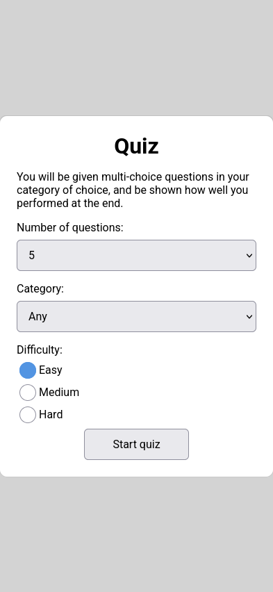
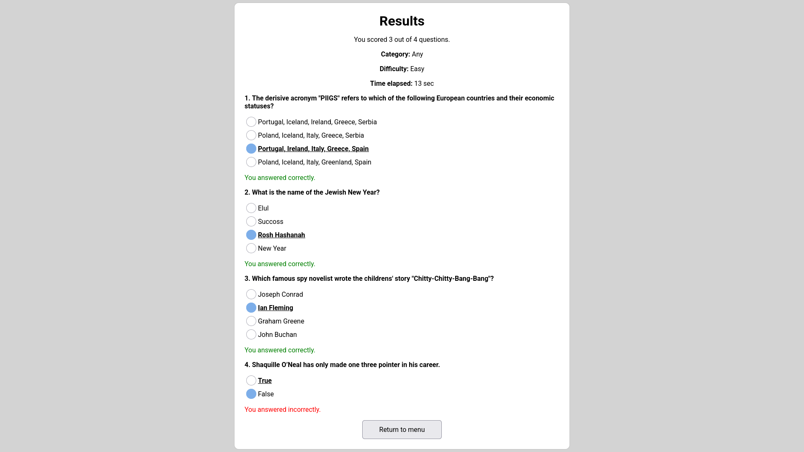
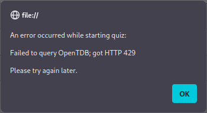
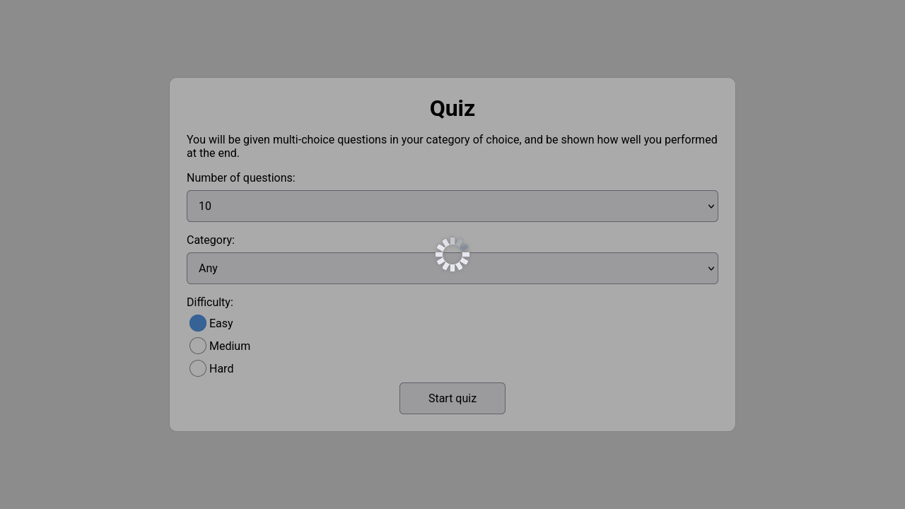
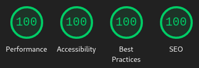

# Quiz

A multiple-choice quiz website, sourcing questions from [OpenTDB](https://opentdb.com).

It utilises pure JavaScript and CSS, with no frameworks, and is responsive to different devices and viewports.

## Project Brief

## Technologies

- JavaScript
- HTML
- CSS
- [OpenTDB](https://opentdb.com)

## Key Features

- Flexibility
	- Users can choose the subject area they wish to be quizzed on, the number of questions, and the difficulty.
- Results page
	- At the end of the quiz, you are shown how many questions you got right, what you answered the questions with, and what options were right.
- Elapsed time
	- The results page shows how much time you spent doing the quiz, which users can use to see if their recall skills are improving.

## Screenshots

Took at different resolutions to showcase responsiveness.

## Constraints

A constraint that arose during development is that **OpenTDB has a 5 second rate limit**. This can present an issue if, for example, you start a quiz, decide the options you chose were wrong, and start a new quiz in a short period of time. Error reporting was implemented primarily as a response to this. Instead of users clicking the Start Quiz button with no feedback or description of what went wrong, leading them to be confused, they are now presented with an error message, along with a suggestion to try again later.

The error message is presented using the standard JavaScript `alert` function. This isn't as presentable as what a proper modal on the web page itself would be, but for such an edge case, it suffices.

Another constraint that may be obvious is that **internet requests can have high latency**, especially when the endpoint is querying a database. So users know that questions are being loaded, a throbber is shown in the middle of the page, also darkening the background to enhance visibility.

## Validation

This website passes the W3C's HTML and CSS validators. There are warnings, but they are minor and are due to how the site works.

The HTML validator warns about `quiz-heading` being empty, but that's okay because that element isn't visible yet, and is filled in before shown.

The CSS validator warns about the `background-color` and `border-color` for radio buttons being the same, but this is intentional.

JavaScript validators also pass, but depending on their configuration may complain about formatting choices.

## Accessibility

### Design Choices

Buttons and other inputs are padded out to give a larger hit area. This should help people with dexterity issues and those on smartphones.

The design of the page is minimal, and colours are used sparingly. The current use for colours (outside of backgrounds and borders) are blue for selected radio buttons, and green and red for correctly and incorrectly answered questions on the results page.

The use of green and red labels on the results page makes it much easier to find correctly and incorrectly answered questions, as the colours stand out against the background, more than what just "correct" and "incorrect" as plain text does.

### Testing

#### Lighthouse

Testing with Lighthouse gives full scores:

The SEO score was 90 until [7598d53](https://github.com/Insaniquarium/quiz/commit/7598d535) which added a meta description tag. The performance score can also fluctuate a tiny bit, but that's the due to the latency of Google Fonts.

#### Screen Readers

Using screen readers unfortunately gives a sub-par experience. While things were done to attempt to help them early during development (e.g., use of `aria-labelledby` and `<strong>`), they didn't appear to help, and there are a few issues:

- New page contents are not read after a page change
	- Infact, NVDA may say the page is empty
	- Caused by the SPA approach
	- Could be fixed if something like the first heading in a page was automatically focused and its tab index set accordingly
	- Worked around by user manually setting focus
		- However, their focus may rather annoyingly start at the bottom of the page, since the menu button is the only focusable element by default.
- Correct and incorrect answers are not indicated
	- Thus, users won't know what they should've answered. I had tried setting `aria-label` to something that indicates it textually, but oddly that was not respected.

Tested with NVDA on Chrome and Firefox.

## Deployment

This website was deployed using GitHub Pages, you can access it at https://insaniquarium.github.io/quiz.

To deploy it yourself, you should be able to upload it to any webhost in any directory, as the paths in the HTML are relative.
